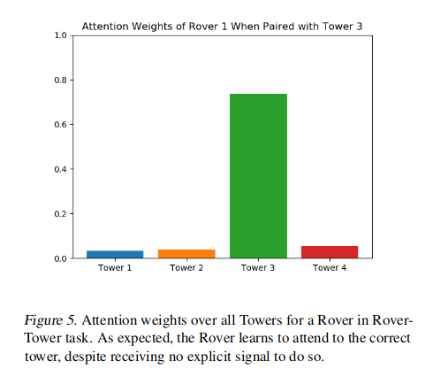

이 논문을 읽게 된 이유: 직접적으로 Attention을 언급하기도 했거니와 최근 알게된 multi attention을 여기서 보이고 있는 것 같아서. ICML 2019 [PDF](http://proceedings.mlr.press/v97/iqbal19a/iqbal19a.pdf)

## Introduction

* MADDPG, COMA

  * A critic(or a number of critics) is centrally learned with information from all agents.

  * The actors receive information only from their corresponding agents.

    * MADDPG

      1) Mixed reward enviroments.
  
      2) Reduce the non-stationarity of multi-agent environments - as considering the actions of other agents to be part of the environment makes the state transition dynamics stable from the perspective of one agent.
  
      3) Stabilize learning, due to reduced variance in the value function
  
    * COMA
  
      1) With shared rewards
  
      2) "Counterfactual baseline" for calculating the advantage function which is able to marginalize a single agent's action while keeping others fixed.
  
      3) The advantage function only encourages actions that directly influence an agent's rewards
  
  
  
* The main idea is

  * to learn a centralized critic with an attention mechanism.
  * to have an input space lineary increasing w.r.t the number of agents, as opposed to the quadratic increase in MADDPG.
  * to setup any reward, different action spaces for each agent, a variance-reducing baseline that only marginalizes the relevant agent's actions, and with a set of centralized critics that dynamically attend to the relevant information for each agent at each time point.

## Methods

* The attention mechanism functions in a maaner similar to a differentiable key-value memory model.
  * Intuitively, each agent queries the other agents for information about their observations and actions and incorporates that information into the estimate of its value function.
  * Doesn't make any assumptions about the temporal or spatial locality of the inputs.

### Attention

* Q-value funtion : 

  $$Q^{\phi}^{i}(o, a) = f_{i}(g_{i}(o_{i}, a_{t}), x_{i})$$ where $$f_{i}$$ is a 2-layer MLP, $$g_{i}$$ is a 1-layer MLP.

* The contribution from other agents : 

  $$x_{i} = \sum_{j \neq i} \alpha_{j}v_{j} = \sum_{j \neq i} \alpha_{i} h(Vg_{j}(o_{j}, a_{j}))$$ where $$v_{j}$$ is a function of agent $$j$$'s embeding, encoded with an embedding funtion and then linearly transforme by a shared matrix $$V$$. $$h$$ is an element-wise nonlinearity.

* Attention weight : 
  $$\alpha_{j}$$ compares the embedding $$e_{j}=g_{j}(o_{j}, a_{j})$$ using bilinear mappaing( i.e. the query-key system) and softmax

  $$\alpha_{j} \propto \text{exp}(e^{T}_{j}W^{T}_{k}W_{q}e_{i}) = \text{exp}((W_{k}e_{j})^{T}W_{q}e_{i})$$

  where $$W_{q}$$ transforms $$e_{i}$$ into a "query" and $$W_{k}$$ transforms $$e_j$$ into a key._{t})$$
  
  *→ Measure는 Dot Product*
  
  *→ Multi-head는 사기... 그냥 agent 별로 Attention을 적용한다는 말인데 뭘 이렇게 고급지게 표현했지?!*

* In this paper,
  * Used multiple attention heads.
  * Each head using a separtae set of parameters ($$W_{k}, W_{q}, V$$)
  * Gives rise to an aggregated contribution from all other agents to the agent $$i$$ and simply concatenate the contributions from all heads as a single vector.
  * Each head can focus on a different weighted mixture of agents.

* Weights ($$W_{k}, W_{q}, V$$) are shared across all agents
* The sharing of critic parameters between agents is possible

### Advantage Function

* An advantage function using a baseline that only marginalizes out the actions of the given agent from $$Q^{\phi}_i}(o, a)$$, can help solve the multi-agent credit assignment problem. [Foerster et al. 2018](https://arxiv.org/pdf/1705.08926.pdf)
* By comparing the value of a sepecific action to the value of the average action for the agent, with all other agents fixed, can learn whether said action will cause an increase in expected return or whether any increase in reward is attributed to the actions of other agents.

$$A_{i}(o, a) = Q^{\phi}_{i}(o, a) - b(o, a_{-i})$$

where $$b(o, a_{-i}) = \mathbb{E}_{a_{i} \sim \pi_{i}(o_{i})\big[ Q^{\phi}_{i}(o, (a_{i}, a_{-i})) \big]}$$

* Natural decomposition of an agents encoding $$e_i$$, and the weighted sum of encoding of other agents, $$x_i$$
  * Doesn't assume the same action space for each agent
  * Doesn't require a global reward
  * Attens dynamically to other agents, as in Q-function

### Learing

$$\mathcal{L}_{Q}(\phi) = \sum_{i=1}^{N} \mathbb{E}_{(o, a, r, o') \sim D}\big[ (Q_{i}^{\phi}(o, a) - y_{i})^{2} \big]$$

where $$y_{i} = r_{i} + \gamma \mathbb{E}_{a' \sim \pi_{\bar{\theta}}[ Q_{i}^{\bar{\phi}}(o', a') - \alpha \log{(\pi_{\bar{\theta_i}}(a'_{i}|o'_{i}))} ]}$$

* $$\bar{\phi}$$ and $$\bar{\theta}$$ are the parameters of the target critics and target policies.

* The action-value estimate for agent $$i$$, $$Q^{\phi}_{i}$$, receives observations and actions for all agents.
* $$\alpha$$ is the temperature parameter determining the balance between maximizing entropy and rewards

*→ 여기서는 MADDPG와 달리 왜 Sum으로 하는가?* : All critics are updated together to minimize a joint regression loss function, "*due to the parameter sharing; multi-agent value-function approximation is a multi-task regression problem.* This parameter sharing allows out method to learn effectively in environments where rewards for individual agents are different but share common features."

$$\begin{equation}

​	\begin{split}

​		\nabla_{\theta_i}\mathcal{J}(\pi_{\theta}) = 

​		\mathbb{E}_{o \sim D, a \sim \pi} \big[ \nabla_{\theta_{i}} \log{(\pi_{\theta_{i}}(a_{i}|o_{i}))} ( - \alpha \log{(\pi_{\theta_{i}}(a_{i}|o_{i}))}  +  Q^{\phi}_{i}(o,a) - b(o, a_{-i})) \big]

​	\end{split}

\end{equation}$$

* The individual policies are updated by ascent with the gradient above.
* [NEED TO CHECK] Sampling all actions, a, from all agents' current policies Unlike in the MADDPG algorithm, where the other agents' actions are sampled from the replay buffer, potentially causing overgenralization where agents fail to coordinate based on their current plicies.

## Experiments

## ?

* 커뮤니케이션 연구인데, 왜 커뮤니케이션과 비교는 안 하고 커뮤니케이션 없는 애들만 비교하는가?
  * DQN이든 Actor-Critic이든간에 Task 성능으로 비교해야할터인데, 비슷하게 학습했다고 걔네만 가져다가 비교하면 제대로된 결과가 나올까?
* 음. Attention을 제대로 쓰는 줄 알았는데 구조로만 보았을 때는 그다지 흥미가 높은 논문은 아니었다. 
  * Figure 5만 보아도 그냥... 그렇구나. 겨울에 눈 오는 얘기를 하고 있으니 재미가 없을 수 밖에.
* 오히려 COMA랑 MADDPG notation 이해한다고 시간 엄청 잡아먹었네...

## + 

저자가 학회를 위해 만든 [슬라이드](https://icml.cc/media/Slides/icml/2019/hallb(13-16-00)-13-17-10-5142-actor-attention.pdf)에서 발췌한 그림. 나중에 랩세미나 준비할 때 써먹어야지ㅎㅎㅎ

