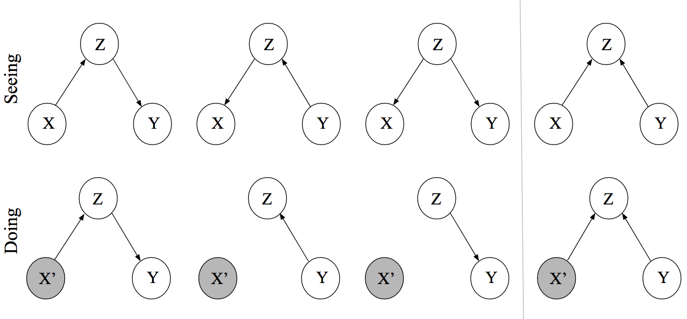

Causality와 Probability의 Conditioning 부분이 너무 헛갈려서 애먹고 있는데, 몇몇 블로그[^1][^2]에서 아이디어를 얻고 연구실원의 도움을 받아 이해를 점점 하고 있는 중이다. 번역을 하면 나중에 까먹을 때 다시 돌아보기 좋겠지만, 그럴만한 시간은 없는 관계로 일단 intuition 정도만 정리를 해본다.

## Conditional Probability

이번에 고민을 좀 하면서 확률에 대해서 다시금 생각해보게 되었다. 일반적으로 받아들여지는 확률의 연관성이라는 것이 인과성을 보장하지는 않는다. 따라서 우리가 흔히 하는 Classification이라는 Task에서도 어떤 패턴과 어떤 값 사이의 연관성이 있기 때문에 그것을 유추하는 것이지, 어떤 패턴이기 때문에 어떤 값이 도출된다라는 인과성은 아닌 것이다. 조건부 확률(Conditional Probability) 
$$p(A|B)$$
라는 것도 어떤 값 $$B$$가 주어졌을 때, 다른 값 $$A$$가 함께 나타날 확률이라는 것은 연관성(Likelihood)이지 인과성은 아닌 것이다. $$B$$가 나타났기 때문에 $$A$$가 나타난 것은 아니다. 그냥 데이터를 보니(seeing) *하필이면* 그러한 패턴=연관성=관계가 나타났을 뿐이다. 그리고 앞으로도 그러한 패턴이 나올 확률이 높기 때문에 우리는 그러한 결론은 도출해낸다. 하지만 데이터에서 *하필이면* 그런 연관성이 **왜** 나왔는지는 알 수가 없다. 

그림출처 [^1]

## Seeing

흔히 생각하는 베이지안 네트워크를 떠올려야 한다. 여기서의 DAG는 "연관성(Association)"에 관련된 것이다. 예를 들어 위쪽 열의 첫번째 그림
$$p(X, Y, Z) = p(Y|Z)p(Z|X)$$
은, $$Z$$는 $$X$$에 영향을 받아 연관성을 가지게 된다. 만약 우리가 $$Z$$를 관찰(observe)할 수 없다면, $$p(Y|X)$$는 어떤 연관성을 가지는 것 처럼 보일 것이다. 예컨대 양의 관계라고 한다면 $$Y$$가 증가하면 $$X$$도 증가하는 것처럼. 그러나 $$Z$$를 관찰하는 순간 더 이상 직접적인 관계는 사라진다. 왜냐하면 $$X$$와 $$Y$$의 관계(연관성)를 결정짓던 요인은 사실 $$Z$$이므로 이것만 알게되면 $$X$$와 $$Y$$가 $$Z$$에 의해 관계를 맺는다라고 말할 수 밖에 없기 때문이다.

이러한 점에서 바라보면 위쪽 열의 세 그림가장 오른쪽 그림 제외)은 실제 데이터 관측에서는 구별을 해낼 수 없다. 결과적으로 우리가 구하게 관찰하게 되는 값은 $$X, Y$$일테고 (혹은 $$Z$$를 관찰가능하거나 잠재 변수라고 생각할지라도) 그 두 변수가 연관성이 있는 방향으로 관찰이 된다라는 것 이상으로는 무언가를 판단하기 힘들다.

## Doing

우리는 어떠한 변수가 특정 값을 가졌을 때 어떤 변화가 생기는지 그 인과 관계를 알고 싶다. 기존의 Seeing에서는 연관성만 알 뿐 이었고, 인과성을 모르는 이유는 결국 $$X, Y$$에서 연관성=패턴=관계를 만들어내게 하는 요인이 있을테지만 우리는 그것을 모른다라는 점 때문이다. 하지만 만약에 우리가 어느 정도의 도메인 지식들로 하여금 $$X, Y$$에 대해 동시에 영향을 미칠 수 있는 조건 $$Z$$를 알고선 DAG를 만들어 본다면 위와 같은 모양들 중 하나(아래열, 왼쪽에서 세번째)로 나타날 것이다.

Doing에서는 Causal Graph라는 것으로 이해를 해야한다. Causal Graph란 각 노드의 부모 노드는 직접적인 인과성(Direct Causes)을 포함하는 베이지안 네트워크를 말한다.[^3] 따라서 Seeing의 베이지안 네트워크보다 좀 더 speicific한 네트워크를 가진다고 할 수 있겠다. 또, 직접적인 인과성(Direct Causes)라는 것은 자식 노드에 연결되어 있는 모든 부모들 중에 하나의 부모 노드만 다른 값으로 변화시키는 경우 자식 노드의 확률 분포의 변화를 야기시킬 수 있다는 것을 의미한다.예컨대 가장 오른편의 그림에서 직접적인 인과성을 본다면 부모 노드 중 하나인 $$Y$$만을 바꾸어주었을 때 자식 노드인 $$Z$$의 확률 분포는 변화하게 된다. 즉, 
$$p(Z=z|X=x, Y=y) \neq p(Z=z|X=x, Y=y') = p_{do(Y=y')}(Z=z|X=x)$$

여기서 중요하게 넘어가야할 점은 개입(Intervention)이라는 개념이다. 만약 $$X$$에 특정값으로 개입을 한다고 생각해보자. 아래열 두번째 그림에서 $$Z$$는 변수 $$X$$에 인과성을 지니는 부모 노드이다. 그러나 $$X$$가 특정값으로 개입되어 고정이 된 상태라면 더 이상 인과성은 없어지게 된다. $$Z$$를 아무리 변화해도 $$X$$는 실험자가 개입한 상태에서 변화가 없기 때문이다. 세번째 그림도 마찬가지인 상황이므로 똑같은 그래프로 남게 된다. 우리는 우리가 개입하고자 하는 노드에서 들어오는 방향의 화살표를 제거해주는 것으로 Causal Graph를 수정해줄 수 있게 된다.

이러한 과정은 $$X$$와 $$Y$$ 사이에서 특정한 인과성을 보고자 할 때, 기존의 연관성만 볼 수 있는 Seeing 단계 혹은 Observational Study에서는 $$Z$$라는 변수가 항상 존재하기 때문에 우리는 $$X, Y$$를 직접적으로 비교해볼 여유가 없다. 그러나 인과성을 끊어주는 순간 우리는 오롯이 $$X$$의 값으로만 $$Y$$의 변화를 판단할 수 있게 된다 ($$Z$$는 우리가 흔히 하듯이 Marginalized out/Weighted sum을 하면 되고 이것은 $$Y$$에게만 영향을 미칠 뿐 $$X$$의 값에 대해서는 하등 상관이 없게되겠다).

## Counterfactual

이 부분은 조금 더 공부를 해야될 것 같다.

[^1]: https://fabiandablander.com/r/Causal-Inference.html
[^2]: https://www.inference.vc/causal-inference-2-illustrating-interventions-in-a-toy-example/
[^3]: http://www.homepages.ucl.ac.uk/~ucgtrbd/talks/bayesnetmeetup_causality.pdf